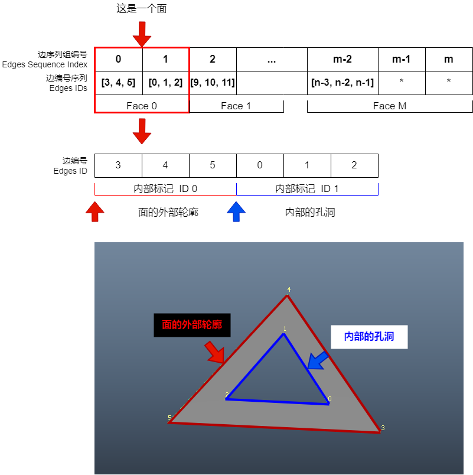

# Mesh 数据是怎么组成的 ？

译: ChatGPT-3.5 Xiemh 图：Xiemh

未经授权，禁止转载。本人保留译文的全部权利

原文为Maya官方文档中的一个小节 


地址: 
https://help.autodesk.com/view/MAYAUL/2024/CHS/?guid=Maya_SDK_Polygon_API_How_polygons_are_handled_html

翻译描述可能并不准确，并且也可能存在错漏。本文中部分将Vertices 写作 Vertex 它们是同一个东西。
一切以原始文档为准。


## 多边形 (polygon) 在Maya内部是如何处理的

多边形 (polygon) mesh 是由基本数据结构的组件(面、边、顶点)组成的。 这个数据结构被封装在一个多边形 (polygon) mesh 节点中， 以保证在 Maya 的核心构架--依赖关系图 中提供结构。这些概念对于在Maya中操作和与多边形交互至关重要。

译者注： 这节是废话，无法理解可以不看


## 多边形 (polygon) 的组件

多边形网格(polygon mesh)由三种基本组件组成：

1. 顶点 (Vertices)
2. 边   (Edges)
3. 面   (Faces)

除了这三个基本的多边形组件外，还有两个额外的组件，同样在理解如何在 Maya 中处理多边形(polygon)时非常重要：

1. 面-顶点 (Face-Vertices)
2. UV坐标  (UVs)


## 顶点  (Vertices)


多边形网格(polygon mesh)的顶点(Vertices)存储在一个简单的3D浮点点数组中，每个点都有基于数组中给定索引的顶点ID。后续讲到的边和面都基于此数组。


译者注： 这里的 X Y Z 就是每个顶点的 X Y Z 轴的坐标。可以理解为这样的概念：
```python
Mesh.vtx = [ [ X1, Y1, Z1], [X2, Y2, Z2], ... [Xn, Yn, Zn] ]
```

## 边 (Edges)


多边形网格(polygon mesh)的边(Edges)也存储在一个数组中(边数组 Edge array)。边数组中的每条边都由两个整数组成，这个整数就是顶点(Vertex)的编号(ID)。第一个整数(Vertex ID)表示边的起始顶点，而第二个整数(Vertex ID)表示边的结束顶点。这为边提供了顶点组合、方向和边ID(由边数组的索引表示)。


译者注： 值得注意的是使用数组记录边的起始点到结束点，不仅描述的边的形状位置，还描述的边的方向。这很重要
可以理解为这样的概念：
```python
Mesh.e = [ [A1, B1], [A2, B2], ... [An, Bn] ]

# 加上上面的点的概念, 我们可以假设一种结构
Mesh.vtx = [ [ X1, Y1, Z1], [X2, Y2, Z2], ... [Xn, Yn, Zn] ]
Mesh.e = [ [Mesh.vtx[0], Mesh.vtx[1] ], ... [ Mesh.vtx[-2], Mesh.vtx[-1] ] ]
```


## 面 (Faces)


多边形网格(polygon mesh)的面(Face)存储在一个整数数组中。每个面由一系列整数序列描述，序列内部的每个整数都是一条边的ID。第一个边序列描述面的外边界，任何后续序列表示面中可能存在孔洞。我们用内部标记来记录每个面所有序列的开始和结束，这便是面的描述。



译者注：这里的图例和原文档中的图例略有不同，为了更好的理解这里的概念，我重新设计了这张图例。
可能和官方文档想要表述的不完全相符，但是有利于理解概念。图中所显示的面的组成在工作中是需要极力避免的，因为这会带来一些问题，这种结构在Maya中可以正常实现，但是在其他DCC软件中可能并不行，而且大多数数据交换格式都不支持这种模型结构的承载。请确保你的面内部孔洞和外部边界的边是相连的。大多数据交换格式在储存模型时只储存面的顶点顺序。

```python
Mesh.Face = [ [ (edge3, edge4, edge5) , (edge0, edge1, edge2) ], [ (edge3, edge4, ...) , (...) ], ... ]
```

这里介绍另外一种更加通用的记录面数据的一种方法，使用一个整数数组， 数组内的每一个单元全部由顶点(Vertex)构成。顶点的顺序决定了面的结构，这种结构不支持凭空在面中打孔的操作。


```python
Mesh.Face = [[vtx0, vtx1, vtx2], [vtx3, vtx4, ...], ...]
```


面偏移和索引数组补充了面数组。该数组保存了面数组中每个面描述的起始位置。由于每个面可以由多个边序列以及多个顶点序列组成，因此遍历数组以查找每个面的开头可能是比较麻烦的事情。这个面索引数组提供了快速访问有关每个面的信息的方法。我们将面ID作为面偏移数组的引索ID。除了标记每个面的开始的元素之外，还会在面索引数组的末尾附加一个元素，以标记面列表中的最后一个索引。这个最后的索引数字允许您快速访问每个面的顺序(面中的边数/顶点数)。


译者注：这里的图例和原文档中的图例略有不同，为了更好的理解这里的概念，我重新设计了这张图例。正如上方两个小节所说的。边Offset 实际上是一个引索，可以快速的知道指定的面(ID)所构成的顶点有哪些。这个对于几何计算是非常重要的。

图中，ID 为 0 的面偏移(Offset)值为0，此时需要查询它的顶点数量以及顶点组成。根据下一个面 ID + 1 的引索值可知该面的顶点查询的Index范围是 0 - 3 ， 顶点数为 4 个。 并且是由 0， 1， 3， 2 组成的。 这样如果这个模型面数非常大的话，就不需要遍历一整个模型了。
```python
Mesh.FaceOffset = [0, 4, 8, 12]
Mesh.FaceVertex = [0, 1, 3, 2, 1, 0, 4, 5, 1, 5, 7, 6, 0, 2, 9, 8]

face_range = [Mesh.FaceOffset[ID], Mesh.FaceOffset[ID+1]]
face_count = face_range[1] - face_range[0] + 1
face_vertex = Mesh.FaceVertex[face_range[0]:face_range[1]]
```


## 面-顶点 (Face-Vertices)

在面相邻的情况下，面经常会共用顶点。有时我们会需要将数据关联到特定面的特定顶点，同时将该特定顶点与共享它的任何面区分开来。这些称为 面-顶点(Face-Vertices)。


面-顶点(Face-Vertices) 是一种多边形的概念性组件，其概念可以使用于 —例如— 每个顶点的颜色或者UV坐标。面-顶点(Face-Vertices) 由现有的数据结构表示——面数组和面索引数组。每个面-顶点(Face-Vertices)与特定的面ID和顶点ID相关联。您可以使用面ID在面数组中找到偏移量，然后通过使用每个边的起始顶点在边循环中搜索给定的顶点ID。请注意，每个面中的每个顶点ID都是给定面-顶点(Face-Vertices)的唯一索引——面-顶点(Face-Vertices)索引。共享的顶点ID在面数组中会多次出现，在共享该顶点的每个面描述中都会出现一次。


现在假设我们将其用于UV坐标
在上面的插图中，左图描绘了一个由四个面组成的多边形平面的拓扑结构，而右图展示了该四个面多边形平面的面顶点视图。在面顶点视图中，每个面都是分开的，保持着自己独立的顶点。每个独立的顶点都使用相对于每个面的顶点索引进行标记（即从0到3）。每个面顶点与一个UV相关联。然而，这并不保证每个面顶点都有唯一的UV。默认情况下，对于代表共享顶点的面顶点，比如左图中的顶点4，每个面顶点与相同的UV相关联，因此共享一个UV。将UV进行“分割”会为每个共享顶点的面顶点提供一个唯一的UV ID。

译者注：这里的图例和原文档中的图例略有不同，为了更好的理解这里的概念，我重新设计了这张图例。Face-Vertex 实际上应该是一种抽象的概念。
可以理解为一种模板概念，在MAYA中UV和顶点着色均使用了这个概念来安排数据。*图中的 UV ID 并不代表了真实情况下的 UV ID 排列方式，这里只是便于理解。*

```python
Mesh.Face = [ [0, 1, 4, 3], [ 1, 2, 5, 4], ... [] ]
Face-Vertex = (0  1  2  3)  ( 0  1  2  3)  ... 
```

## UV坐标 (UVs)

UV坐标在很大程度上依赖于面-顶点(Face-Vertices)的概念。UV坐标对应于一个二维平面，用于将纹理映射到多边形表面上。纹理映射是逐个面进行的。因此，为了允许每个面具有自己的一组映射坐标，UV坐标是基于面-顶点(Face-Vertices)的。在Maya中，保存UV坐标的结构由两个数组组成：

1. 一个UV索引数组，它使用与面数组完全相同的索引（可以视为 面-顶点(Face-Vertices) 数组）。
2. 一个UV数组，它保存由 UV ID 索引的UV点列表。

第一个数组将每个面顶点与特定的 UV ID 关联起来，如果面顶点所属的面没有进行映射，则不进行关联。每个 UV ID 对应于 UV 列表中的一个索引，该索引保存了 UV 在 UV 空间中所处的二维坐标（U和V浮点值）。
  


译者注：这里的图例和原文档中的图例略有不同，为了更好的理解这里的概念，我重新设计了这张图例。正如上方两个小节所说的。一个顶点实际上由于被多个面共享，所以实际上在拆分UV时，是可以拆分为多个UV点的，图中就演示了这个现象 点1 由于被两个面共享。所以在将这两个面的UV拆分时， 可以拆分为两个UV点


如这个图所示：UV 点 3 的顶点由 两个面共享， 但是，由于这两个面没有拆分，所以 UV 点 3 也还是由这两个面共享。 UV 点 7 和 9 实际拥有同一个 顶点，但是这里我们将UV经行了拆分。 所以分配了 新的 UV ID 给它们。

## Mesh结构总结
mesh 的基本数据上可由以下的代码获取

```python
# 这里举一个正方体Mesh的例子
mesh_object = pm.PyNode("pCube1")

mesh_object.vtx[x].getPosition()
P0 = [-0.5, -0.5,  0.5]
P1 = [ 0.5, -0.5,  0.5]
P2 = [-0.5,  0.5,  0.5]
P3 = [ 0.5,  0.5,  0.5]
P4 = [-0.5,  0.5, -0.5]
P5 = [ 0.5,  0.5, -0.5]
P6 = [-0.5, -0.5, -0.5]
P7 = [ 0.5, -0.5, -0.5]

def get_face_offset():
    face_offsets = [0]
    for face in mesh_object.f:
        per_face_vertex = len(face.connectedVertices())
        face_offsets.append(face_offsets[-1] + per_face_vertex)
face_offset = (0, 4, 8, 12, 16, 20, 24)  

mesh_object.getVertices()
vertex_array = [0, 1, 3, 2, 2, 3, 5, 4, 4, 5, 7, 6, 
                6, 7, 1, 0, 1, 7, 5, 3, 6, 0, 2, 4]   # vertex ID

mesh_object.getUVs()
U_array = [0.375, 0.625, 0.375, 0.625, 0.375, 0.625, 0.375, 0.625, 0.375, 0.625, 0.875, 0.875, 0.125, 0.125]
V_array = [0.0,   0.0,   0.25,  0.25,  0.5,   0.5,   0.75,  0.75,  1.0,   1.0,   0.0,   0.25,  0.0,   0.25]


```