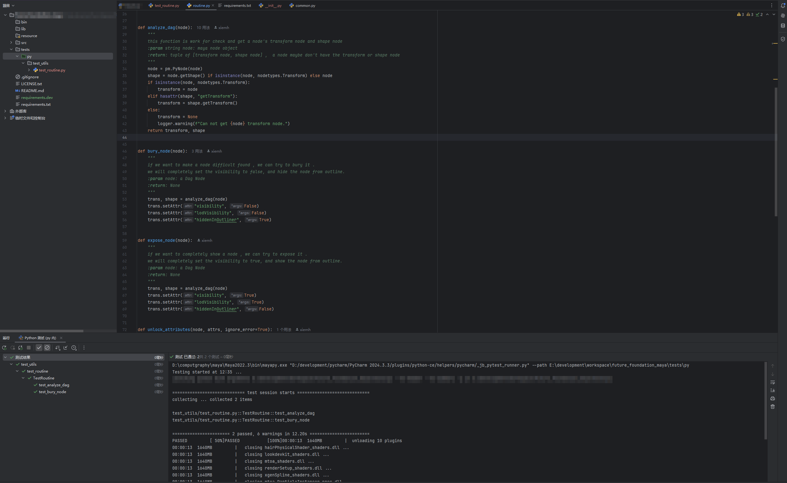
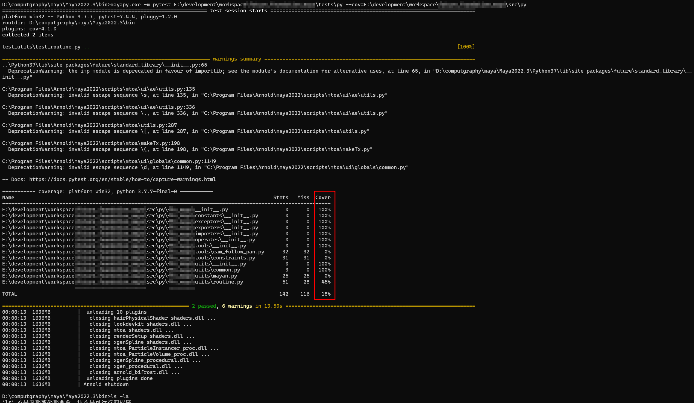
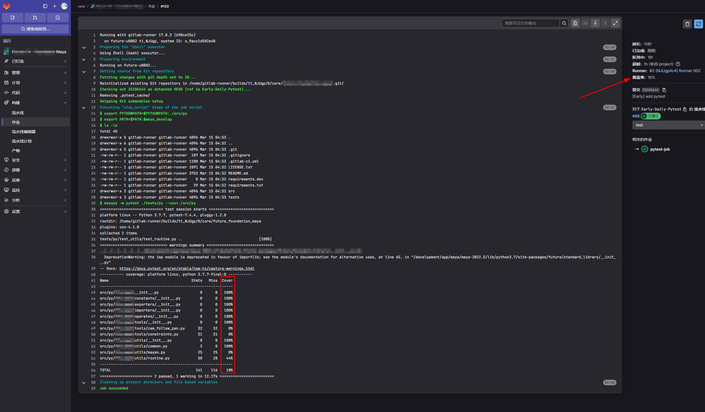

# 如何在 Maya 中进行单元测试 ？

前言：
  - 什么？ 我们为什么要单元测试？ 
  - 为什么不做？

这篇简单的文章用于记录如何使用 maya 做 pytest 单元测试。

废话不看版：
将可执行文件 mayapy 当作一个python解释器使用。

完整版：

都已经到单元测试了，应该不需要讲环境设置部分以及 mayapy 在哪的部分了。

首先使用 mayapy 安装所需要测试包：

```shell
# windows
mayapy.exe -m pip install pytest pytest-cov

# linux
mayapy -m pip install pytest pytest-cov
```

做单元测试：
```shell
# windows
mayapy.exe -m pytest your-test-folder --cov=your-source-code

# linux
mayapy -m pytest your-test-folder --cov=your-source-code
```

这种方法基本可以测试大部分maya中的操作。GUI部分的不行。

pycharm 设置：
直接讲 mayapy.exe 当一个python解释器设置

结果：



可以正常获取覆盖率


gitlab 正常获取覆盖率



