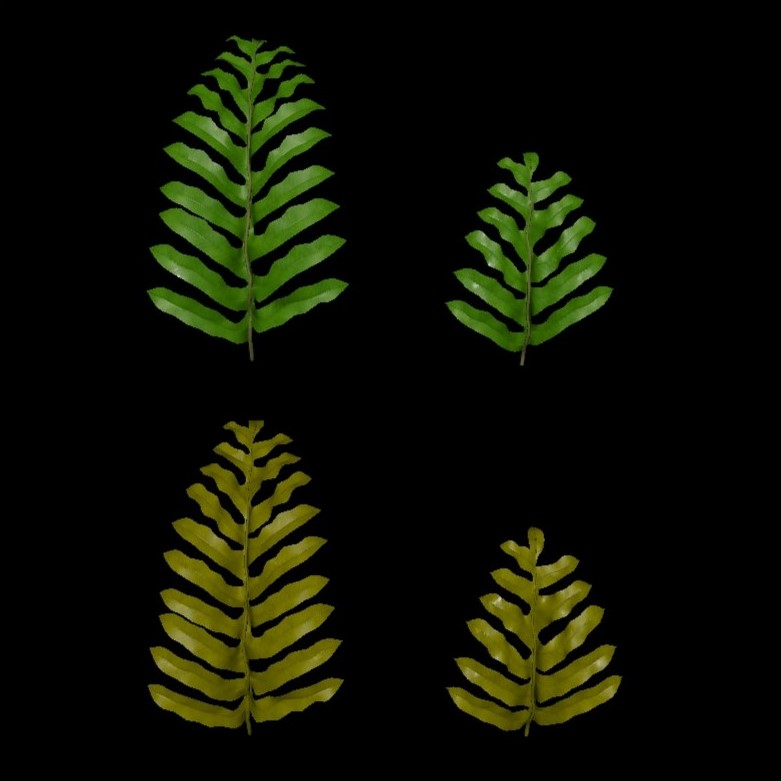
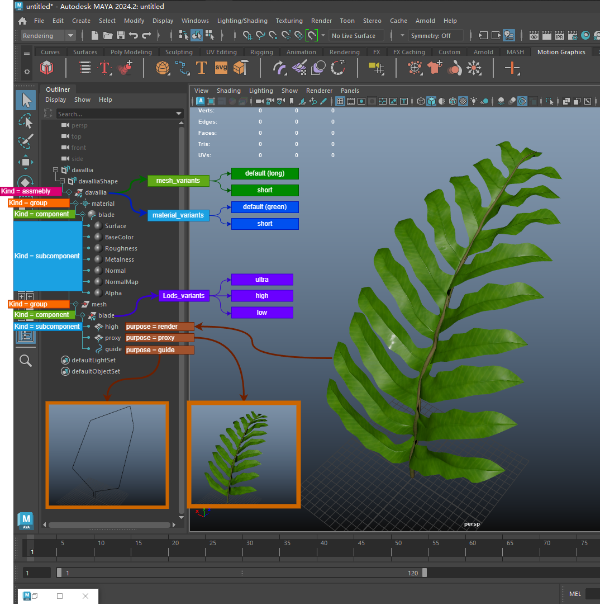

# 分享一个USD资产 Davallia
———————————————————————————————————

最近在研究USD流程相关的东西，制作了一个纯 USD + MaterialX 的资产 Dalli。
支持 2 种 形状变体， 2 种 颜色变体， 3 种 lods 变体。 支持 Render / Proxy / Guide 3 种 purpose。

常用的 Variant Kind Select PurPose 等基本功能都已经支持了。

这里将模型和材质的 variants set 全部都放在了 davallia 组下。 并设置了 kind = assembly
便于切换。 同时支持了多种 purpose 方便在不同使用场景下的情况。

参考了 houdini 的 usd 标准结构，这种结构是目前想到的相对比较好的构想。
将源文件分享出来互相学习

百度网盘下载链接
链接：https://pan.baidu.com/s/1XGr-f8e8eY_KkvO9n6dGlg?pwd=0xqa
提取码：0xqa
